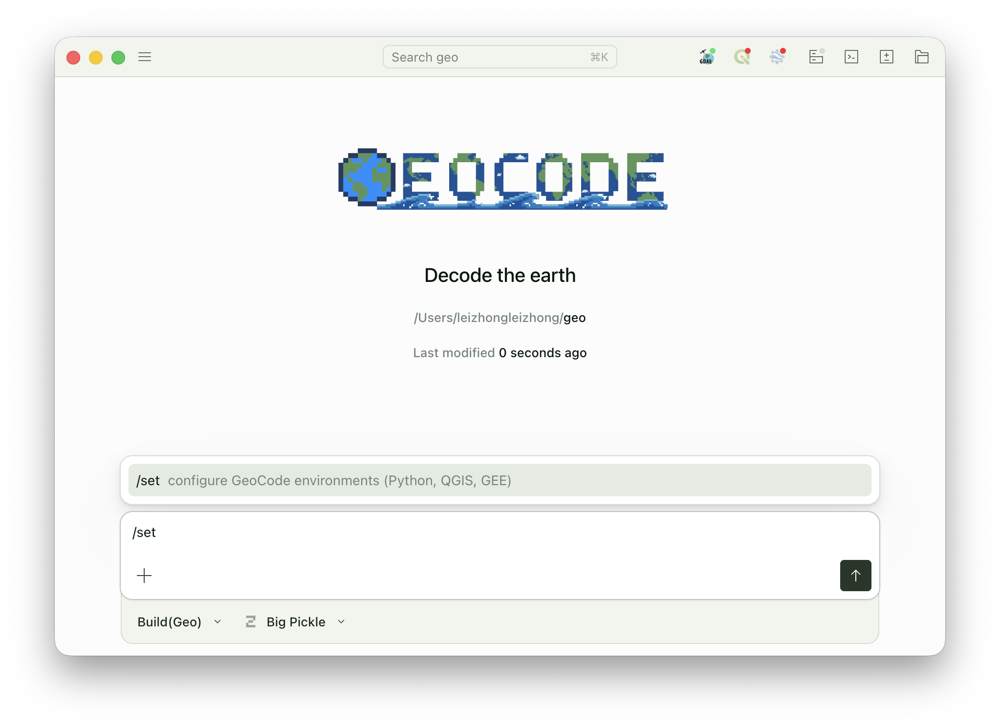
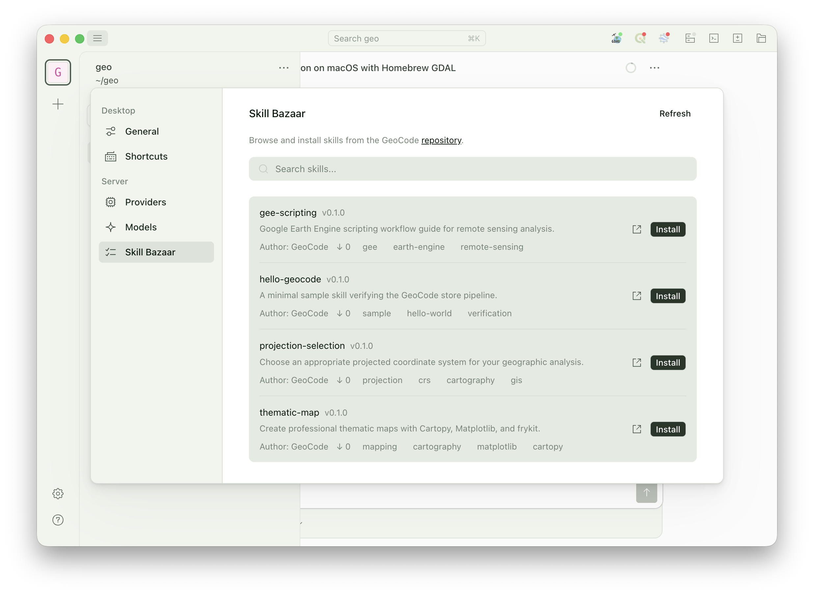

<p align="center">
  
</p>

<p align="center"><strong>桌面端地理科学数据处理智能助手</strong></p>

<p align="center">
  <a href="README.md">English</a> &nbsp;·&nbsp; 简体中文
</p>

<p align="center">
  
  
  
  
  
  <a href="LICENSE">
    
  </a>
</p>

<p align="center">
  <a href="https://github.com/zzhonglei/GeoCode-Release/releases">🚀 下载</a>
  ·
  <a href="contributions/">✨ Skill 集市</a>
  ·
  <a href="https://github.com/sst/opencode">🌳 上游 OpenCode</a>
</p>

---

## GeoCode 能做什么

在对话中完成复杂的地理数据处理任务，让人人都能分析这个地球 🌏...

| 能力                       | 范围                                              | 具体案例                                        |
| -------------------------- | ------------------------------------------------- | ----------------------------------------------- |
| 🗺️ **QGIS**                | QGIS Processing 中的**全部数百个算法**            | 空间分析、矢栅批处理、格式互转、可达性分析...   |
| 🛰️ **Google Earth Engine** | **完整 GEE Python API**，任何可表达的遥感任务      | 时序合成、分类、变化检测、地表温度、影像下载... |
| 🐍 **Python**              | 在隔离环境里跑**任意 Python 脚本**，完整科学计算栈 | 地理数据处理、专题地图制作、深度学习...         |
| ✨ **Skill**               | 按需安装的能力包，**让 GeoCode 随需而长**          | 随时获取社区共建的能力包，共筑地理科学生态...    |

## 怎么用

### 1. 你需要配置什么环境？

不需要任何复杂的环境配置。在安装 GeoCode 之前，只需要在电脑上预装两样东西：

- **[QGIS](https://qgis.org/download/)** —— 桌面 GIS 应用，GeoCode 调它的算法
- **Python 环境管理工具**（推荐 [Miniconda](https://docs.anaconda.com/miniconda/)）—— 隔离 Python 依赖，让 GeoCode 跑脚本互不干扰

> [!TIP]
> 给 GeoCode 的智能体准备**独立的 Python 环境**（用 Conda / Mamba 新建一个 env）。智能体执行任务时会自行装、卸载、升级 Python 依赖，独立环境能避免污染你其他项目，也能让智能体跑得更稳。

### 2. GeoCode 版本

GeoCode 当前以 0.9.x 系列进行公开预览，从 [Releases](https://github.com/zzhonglei/GeoCode-Release/releases) 获取最新版本。欢迎尝鲜、欢迎反馈。

| 版本 | 发布日期 | 更新说明 |
| :--- | :--- | :--- |
| [**v0.9.4**](https://github.com/zzhonglei/GeoCode-Release/releases/tag/v0.9.4) `最新` | 2026-06-12 | `紧急修复` 针对 v0.9.3 的紧急修复——Windows 安装程序的文件组织错误 |
| [**v0.9.3**](https://github.com/zzhonglei/GeoCode-Release/releases/tag/v0.9.3) | 2026-06-12 | `新增` 内置 Playwright MCP，智能体可以自己操控浏览器了（默认关闭，需手动开启）<br>`优化` OSM 数据下载子智能体的工作流程更加顺畅<br>`优化` 智能体读取地理数据更高效<br>`修复` 部分模型视觉能力失效的问题<br>`修复` Codex（OpenAI 订阅）无法登录的问题<br>`修复` 若干已知问题 |
| [**v0.9.2**](https://github.com/zzhonglei/GeoCode-Release/releases/tag/v0.9.2) | 2026-05-07 | `修复` 部分 QGIS 版本的兼容性问题<br>`修复` 部分 Windows 机型「设置」窗口卡顿问题 |
| [**v0.9.1**](https://github.com/zzhonglei/GeoCode-Release/releases/tag/v0.9.1) | 2026-05-05 | `修复` Windows 平台 Google Earth Engine 显示异常 |
| [**v0.9.0**](https://github.com/zzhonglei/GeoCode-Release/releases/tag/v0.9.0) | 2026-05-04 | `首发` 公开预览版 |

> [!TIP]
> 本仓库主要用于发布 GeoCode 的 **Skill**；GeoCode 每个版本的源代码会随 release 包一起发布。

### 3. 如何配置

装好 QGIS 和环境管理工具，启动 GeoCode，在输入框敲 `/set` 进入配置向导，跟着提示走完即可。

<p align="center">
  
</p>

> [!TIP]
> 不建议使用 OpenCode 内置的免费模型，能力有限，不足以支撑真实任务。推荐自备 [**DeepSeek v4**](https://platform.deepseek.com/sign_in) API Key，或登录 **ChatGPT Plus** 会员账号，体验会有明显提升。

## Skill 集市

Skill 是智能体能否顺利工作的关键一环。GeoCode 提供了便捷的 Skill 管理界面 —— 浏览、安装、启用、禁用全部图形化操作，无需手动管理文件。

<p align="center">
  
</p>

> [!TIP]
> 项目初期能提供的 Skill 数量和质量比较有限。随着用户增多、社区贡献者加入，集市会逐步出现更多优质 Skill。

### 如何贡献你自己的 Skill

GeoCode 的所有 Skill 都托管在 [`contributions/`](contributions/) 目录下，任何人都可以提交 Pull Request 贡献新 Skill。一个 Skill 包的标准目录结构：

```
contributions/<your-skill-id>/
├── manifest/
│   ├── README.md       # 关于 Skill 的介绍文档
│   └── meta.json       # 元数据：version / description / author / tags ...
└── skill/
    ├── SKILL.md        # 必需，核心提示词（给智能体看，带 frontmatter）
    └── <dir>/          # 可选，任意命名、任意嵌套，存放参考资料、模板、脚本等
```

提交流程：

1. Fork 本仓库，在 `contributions/` 下新建你的 Skill 目录
2. 按上面结构填好 `manifest/` 和 `skill/`
3. 提交 Pull Request，CI 会自动校验 schema、版本号、目录结构
4. 通过 review 后由维护者合并发布

> [!TIP]
> Skill 会被加载到智能体的提示词中，直接影响其行为。所有 PR 在合并前会经过维护者人工 review，排查恶意指令或不安全操作。

## 致谢

GeoCode 在项目设计与技术决策过程中得到以下研究团队的指导：

- China University of Geosciences (Wuhan) · [**UrbanComp Lab**](https://urbancomp.net/)
- LIESMARS, Wuhan University · [**Urban Spatial Intelligence Research Group**](https://github.com/WHU-USI3DV)

## 许可证

MIT —— 详见 [LICENSE](LICENSE) 和 [NOTICE](NOTICE)。
